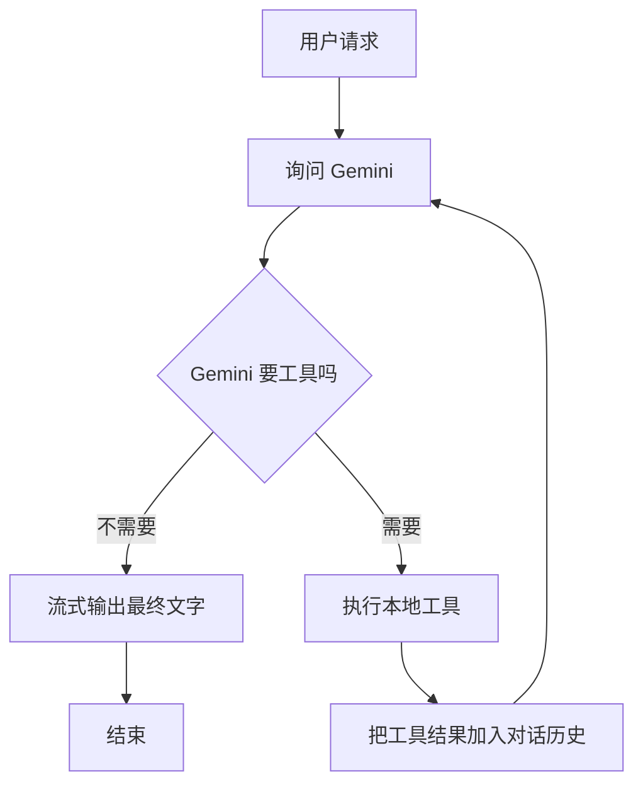

我先不急着改代码，也不先给你塞一堆异步概念。先把你当前项目的目录、最近改动和几个核心文件摸清楚，然后我会用“用户一句话进来后，代码到底按什么顺序走”的方式，帮你画出一条主线，再指出现在具体绕在哪。

现在能看到你正在改的核心链路正好集中在 `llm/gemini.py`、`memory/memory_manager.py`、`swe/agent.py` 和新入口 `Main/main.py`。我接下来把这几层分别读一遍，先区分每层“应该负责什么”，再找当前代码里职责混在一起或调用方式对不上的地方。

我已经找到你“越改越晕”的主要原因了：不是你不懂 Agent，而是当前代码同时在改 **入口、模型流、工具循环、历史压缩** 四件事，而且其中有几处旧接口和新接口混在一起。为了不凭感觉下结论，我再对照一下改动前的版本和各个对象的调用位置，然后给你一份“先做哪一步、后做哪一步”的最小路线。

为了让你知道“现在到底是设计没想通，还是代码本身先跑不起来”，我再做一次只读检查：看编辑器诊断和现有测试入口。这样我会把问题分成两类——**先修的硬错误**，以及**之后再想的流程设计**，避免它们继续搅在一起。

主线已经基本清楚了。我还要确认一个容易踩坑的 Gemini 细节：工具调用后，历史里应该怎样原样放回 `model_content` 和 `function_response`。这个点如果写错，表面上能流式打印，Agent 却会一直重复调用工具，所以我用官方文档核对一下再给你结论。

你现在不是“Agent 逻辑学不会”，而是一次同时改了 **5 层代码**：

1. Gemini 普通调用改流式调用
2. 同步函数改异步函数
3. 递归思考改 `while` 循环
4. 工具执行改异步线程
5. 上下文压缩也跟着改异步

这些东西搅在一起，谁都会晕。

我先给你一个最重要的结论：

> **Agent 本质上就是一个不断重复的 while 循环。没有那么神秘。**

---

# 一、先把 Agent 想成一个跑腿的人

用户说：

> 帮我读取 `test/add.py`，然后告诉我内容。

Agent 的完整工作流程其实就是：

```text
1. 把用户问题交给 Gemini
2. Gemini 说：我要调用 read 工具
3. Python 执行 read
4. 把 read 的结果交还给 Gemini
5. Gemini 根据读取结果生成最终回答
6. 把最终回答显示给用户
```

画出来就是：



这里最关键的是：

> Gemini 不会真的读取文件。  
> Gemini 只会告诉 Python：“请调用 `read`，参数是这个路径。”

真正执行工具的是你的 `Agent`。

---

# 二、每个文件只负责一件事

你现在晕的一个主要原因，就是不知道逻辑应该放在哪一层。

建议牢牢记住下面这张表。

| 文件 | 它只负责什么 |
|---|---|
| `Main/main.py` | 接收用户输入、显示事件 |
| `llm/client.py` | 创建 Gemini Client |
| `llm/gemini.py` | 向 Gemini 发起“一轮”请求 |
| `swe/agent.py` | 控制多轮循环、执行工具、管理历史 |
| `memory/memory_manager.py` | 对过长的历史进行压缩 |
| `Tools/*.py` | 真正读取、写入文件、运行命令 |

## 特别重要

### `llm/gemini.py` 只管“一轮”

它不应该：

- 执行工具
- 决定下一轮
- 管理整个 Agent
- 递归调用自己

它只做：

```text
发送一次 Gemini 请求
    ↓
不断收到文本块
    ↓
把文本块 yield 出去
    ↓
最后给出这一轮的完整结果
```

### `swe/agent.py` 才管“整个任务”

它负责：

```text
询问 Gemini
    ↓
检查有没有工具调用
    ↓
有：执行工具，然后继续下一轮
无：任务结束
```

所以 `while` 应该在 `Agent.think()` 里面，而不是在 `gemini.generate()` 里面。

---

# 三、你需要理解的异步，其实只有三种情况

## 1. 普通同步函数

```python
def read(path):
    return "文件内容"
```

调用方式：

```python
result = read(path)
```

---

## 2. 异步函数

里面没有 `yield`，只返回一次结果：

```python
async def execute_tool():
    return "工具结果"
```

调用方式：

```python
result = await execute_tool()
```

可以把它理解成：

> “这件事需要等一下，等做完后一次性给我结果。”

---

## 3. 异步生成器

里面有 `yield`：

```python
async def generate():
    yield "第一段"
    yield "第二段"
```

调用方式：

```python
async for item in generate():
    print(item)
```

可以把它理解成水管：

> 不是等水全部装满再给你，而是来一点就放一点。

你的下面三个函数都属于这种“水管”：

```text
gemini.generate()
    ↓
Agent.think()
    ↓
Agent.execute()
    ↓
main() 使用 async for 消费
```

---

# 四、正确的事件流应该是什么样

一个完整用户请求，对外建议只出现一次 `start` 和一次 `end`：

```text
start
text
text
tool_start
tool_end
text
text
end
```

例如：

```text
start

tool_start: read
tool_end: read

text: 文件内容是
text: def add(a, b)...
end
```

各事件含义：

| 事件 | 含义 |
|---|---|
| `start` | 整个用户任务开始 |
| `text` | Gemini 输出的一小段文字 |
| `tool_detected` | Gemini 表示想调用工具，可选 |
| `tool_start` | Python 真正开始执行工具 |
| `tool_end` | Python 已经执行完工具 |
| `end` | 整个用户任务完成 |
| `error` | 发生错误 |

你现在的 `tool_use` 容易产生歧义。

因为它可能表示：

- Gemini 发现了工具调用
- Python 正在执行工具
- 工具已经执行完成

建议以后拆成：

```text
tool_detected
tool_start
tool_end
```

但这不是第一步，现在先把主流程跑通。

---

# 五、你当前代码真正卡住的地方

目前项目不是“逻辑可能有问题”，而是代码还不能运行。

我执行了：

```bash
python -m py_compile llm/client.py llm/gemini.py memory/memory_manager.py swe/agent.py Main/main.py
```

首先在 `llm/client.py:25` 就遇到了语法错误。

## 1. Client 还没有正确创建

`llm/client.py:7` 只有类型标注，没有真正赋值：

```python
client: genai.client
```

而且 `genai.client` 是模块，不是 Client 类型。

后面又在使用 `client` 之后才写：

```python
global client
```

因此直接语法错误。

这里以后应该是类似这种思路：

```python
_client: genai.Client | None = None
```

这个文件只需要提供：

```python
get_client() -> genai.Client
```

名字叫 `create_agent()` 也不合适，因为它创建的是 Gemini Client，不是 Agent。

---

## 2. `swe/agent.py` 本身有语法错误

`swe/agent.py:16`：

```python
from llm import gemini,
```

最后多了一个逗号。

`swe/agent.py:113` 创建 `types.Content` 的参数写法也不正确。

`swe/agent.py:109`：

```python
return stream_event(type="error")
```

但是 `think()` 里面有 `yield`，所以它是异步生成器。

异步生成器不能 `return 某个结果`，只能：

```python
yield error_event
return
```

---

## 3. Gemini 根本不知道有哪些工具

你原来的代码会把这些工具传给 Gemini：

```python
tools=[read, terminal, write]
```

但现在 `swe/agent.py:96` 调用 `gemini.generate()` 时，没有传工具。

所以即使其他问题都修好了，Gemini 也不知道存在：

```text
read
write
terminal
```

自然不会生成工具调用。

你在 `llm/gemini.py` 里写的参数：

```python
function_calls
```

这个名字也容易混淆。

应该区分：

```text
tools           Python 告诉 Gemini：你可以使用哪些工具
function_calls  Gemini 回答 Python：我想调用哪些工具
```

因此输入参数更适合叫：

```python
tools
```

---

## 4. 工具执行结果被你算出来后扔掉了

`swe/agent.py:63` 的 `execute_tool()` 里生成了：

```python
formatted_response
```

但是函数结束前：

- 没有返回它
- 没有加入 `self.contents`
- 没有发出 `tool_end`
- 没有更新错误次数

也就是：

```text
工具确实执行了
    ↓
结果生成了
    ↓
结果被丢掉了
    ↓
Gemini 完全不知道工具执行结果
```

这是目前工具循环最核心的问题之一。

`execute_tool()` 最终至少应该返回一份可以放进历史的工具响应。

---

## 5. 不能只保存 Gemini 的文字

你现在在 `swe/agent.py:113` 重新构造模型历史：

```python
types.Content(
    role="model",
    parts=[types.Part.from_text(text=result.full_text)]
)
```

这对普通文字回答勉强可以。

但对工具调用不行。

假设 Gemini 返回的是：

```text
function_call:
    name = read
    args = {"path": "test/add.py"}
```

这不是文字，因此 `full_text` 里可能什么也没有。

你重新构造后，历史就变成：

```text
model: " "
```

工具调用信息消失了。

正确思路是让 `StreamResult` 同时保存：

```python
full_text
model_content
function_calls
usage
stop_reason
```

其中：

> `model_content` 要尽量保存 Gemini 返回的原始 Content，不能只用文字重新拼。

Gemini 官方文档也强调，多轮工具调用时，模型产生的步骤要按原样放回历史。否则 Gemini 可能重复调用工具，或者报历史格式错误。

---

## 6. 历史压缩还是旧调用方式

`memory/memory_manager.py:35`：

```python
tmp = gemini.generate(...)
```

但是 `generate()` 现在是异步生成器。

所以 `tmp` 不是 Gemini 响应，而是一根“流式水管”。

下面这样自然不能使用：

```python
tmp.text
```

而且 `memory/memory_manager.py:40` 还在传已经删除的参数：

```python
use_tools=False
```

## 我的建议

现在先不要做历史压缩。

暂时让它：

```python
return contents
```

或者暂时从 `think()` 中移除压缩。

原因不是压缩不重要，而是：

> 文字流和工具循环还没有跑通，此时加入压缩，只会多出另一条异步调用链。

等 Agent 主流程稳定后，再单独恢复压缩。

---

## 7. `Main/main.py` 目前只是一个空壳

`Main/main.py` 现在：

- 没有创建 Client
- 没有创建 Agent
- 没有注册工具
- 没有把 `prompt` 传给 Agent
- 没有 `async for`
- 没有打印事件
- 没有 `asyncio.run(main())`

而且直接调用：

```python
generate()
```

还缺少必需参数。

最终入口应该是这种职责：

```text
创建 client
    ↓
创建 Agent
    ↓
注册 read/write/terminal
    ↓
async for event in agent.execute(prompt)
    ↓
根据事件类型打印
```

`main()` 不应该执行工具，工具执行还是交给 Agent。

---

# 六、`Agent.think()` 应该长什么样

先不要纠结具体语法，先看白话版伪代码：

```python
async def think(self):
    while 没超过最大轮数:
        # 第一步：问 Gemini
        round_result = None

        async for event in gemini.generate(
            contents=self.contents,
            tools=self.tools,
        ):
            if event 是这一轮结束:
                round_result = event.result
            else:
                yield event

        if 没拿到结果:
            yield error
            return

        # 第二步：保存 Gemini 的原始回复
        self.contents.append(round_result.model_content)

        # 第三步：检查工具调用
        if 没有工具调用:
            yield end
            return

        # 第四步：执行所有工具
        for call in round_result.function_calls:
            yield tool_start

            tool_response = await self.execute_tool(call)

            self.contents.append(tool_response)

            yield tool_end

        # 第五步：不 return，继续 while
```

一句话概括：

```text
问模型 → 保存模型回复 → 执行工具 → 保存工具结果 → 再问模型
```

如果模型没有要求工具：

```text
问模型 → 保存最终回复 → 结束
```

这就是整个 Agent。

---

# 七、建议你按这个顺序重新推进

不要试图一次修完。

## 第一阶段：只让代码能导入

依次修：

1. `llm/client.py`
2. `swe/agent.py` 的语法错误
3. `Main/main.py` 的基本入口

验收标准：

```bash
python -m py_compile ...
```

不再报语法错误。

---

## 第二阶段：只实现纯文字流

暂时：

- 不使用工具
- 不使用历史压缩
- 不考虑错误重试

输入：

```text
请介绍一下 Python
```

期待看到文字一段段打印。

如果纯文字流不通，绝对不要继续做工具。

---

## 第三阶段：只加入一个 `read` 工具

只验证一件事：

```text
用户要求读取文件
    ↓
Gemini 返回 read 调用
    ↓
Agent 执行 read
    ↓
把结果交还 Gemini
    ↓
Gemini 输出最终回答
```

等 `read` 成功，再加 `write` 和 `terminal`。

---

## 第四阶段：增加工具状态事件

加入：

```text
tool_start
tool_end
```

让终端能显示：

```text
正在执行 read...
read 执行完成
```

---

## 第五阶段：最后恢复历史压缩

此时再处理：

```python
compress_contents()
```

历史压缩是优化功能，不是 Agent 能运行的必要条件。

---

## 第六阶段：更新测试

`test/demo5.py` 还是旧的同步写法：

```python
response = agent.execute(prompt)
```

现在 `execute()` 是异步生成器，测试也必须使用：

```python
async for event in agent.execute(prompt):
    ...
```

而且测试里导入的是：

```python
creat_agent
```

当前项目中并没有这个函数。

---

# 八、你现在最应该记住的四句话

1. **`gemini.generate()` 只负责一轮 Gemini 请求。**
2. **`Agent.think()` 用 `while` 控制多轮工具调用。**
3. **工具结果必须加入 `self.contents`，否则 Gemini 不知道工具干了什么。**
4. **流式生成器用 `async for`，普通异步函数用 `await`。**

当前我只做了代码和诊断检查，没有修改你的文件。下一步最稳妥的是先暂时放下 `memory_manager`，从 `llm/client.py` 开始，把“纯文字流”这一条最短链路修通。
