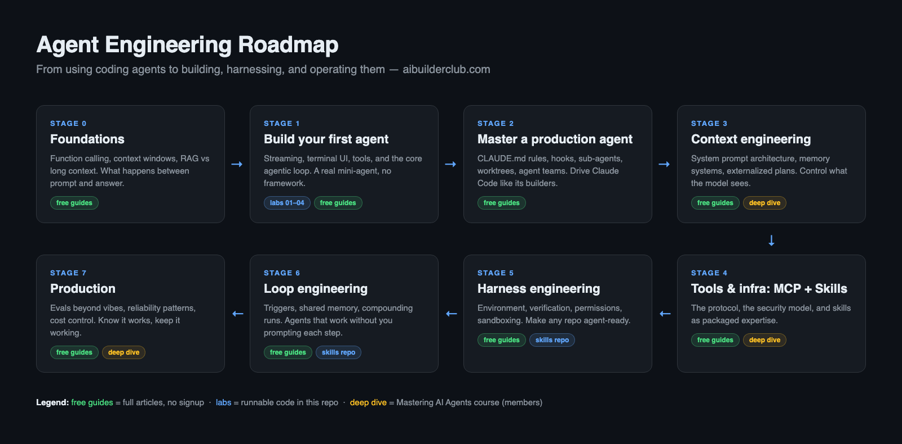

# Agent 工程化路线图 (Agent Engineering Roadmap)

**面向想要理解底层引擎、而非仅仅“驾驭”工具的 AI 建造者路线图。** 一条分阶段的学习路径：从“我每天都在使用 Claude Code”跨越到“我能够构建、驾驭并运维生产级 Agent 系统”。项目附带可运行的代码实验 (Labs)、每个阶段的免费深度指南，以及从零手写 Claude Code 风格 Agent 的完整章节映射图。

由 [AI Builder Club](https://www.aibuilderclub.com/?utm_source=github&utm_campaign=agent-roadmap) 维护。姐妹仓库：[`AI-Builder-Club/skills`](https://github.com/AI-Builder-Club/skills) —— 用于代码库基座 (Harness) 与 Agent 循环的 Claude Code 插件市场。

---

## 为什么存在这份路线图

你每天都在使用 Claude Code、Cursor 或 Codex CLI。你看着它们阅读代码、规划变更、调用工具、管理上下文并从错误中恢复。但当它们出现异常时 —— 而这种情况确实会发生 —— 你只能凭空猜测原因。

* 为什么它忘记了 10 分钟前你告诉它的事？
* 为什么它重写了整个文件，而不是只修改 3 行代码？
* 为什么它会连续 4 次读取同一个文件？

大多数开发者将这些工具视为黑盒。这份路线图旨在改变这一点。在深入阅读 Claude Code、Cursor Agent Mode、Codex CLI、Aider、Windsurf 以及 Gemini CLI 的源码与架构后，我们发现它们在底层均收敛于相同的 **5 层系统架构**：

| 层级 (Layer) | 职责与功能 |
|---|---|
| **交互层 (Interaction)** | 终端 UI (TUI) 或编辑器界面。处理输入、渲染及键盘事件。 |
| **编排层 (Orchestration)** | 会话 Session 引擎。管理多轮状态、Token 预算、斜杠命令、模型切换。 |
| **核心循环层 (Core loop)** | Agent 运行循环 (Agentic Loop)。模型推理 $\rightarrow$ 调用工具 $\rightarrow$ 观察结果 $\rightarrow$ 决定下一步。 |
| **工具层 (Tools)** | 系统能力拓展。读写文件、执行命令、项目代码检索等。 |
| **通信层 (Communication)** | 流式 LLM 连接。消息格式化、重试机制、Token 统计。 |

下文中的每个阶段都将帮助你掌握上述一层或多层架构。

---

## 路线图总览

按阶段 **Stage 0 $\rightarrow$ Stage 7** 循序渐进。每个阶段均包含：**免费指南**（完整文章，无须注册）、**实验 Labs**（本仓库中可运行的代码），以及**深度课程**（🔒 标注，面向 [AI Builder Club](https://www.aibuilderclub.com/courses/mastering-ai-agents?utm_source=github&utm_campaign=agent-roadmap) 会员）。

**如何使用本路线图：**
- **Agent 初学者？** 从 **Stage 0** 开始，完成 **Stage 1** 的 Labs，然后按顺序推进。
- **每天都在使用 Claude Code？** 快速浏览 Stage 0-1（但建议做 Lab 04 —— 其循环实现会改变你调试 Agent 的思路），然后从 **Stage 2** 正式开始。
- **正在构建生产级系统？** **Stage 5-7** 是绝大多数人容易忽略的部分，切勿跳过。

**前置条件：** 熟悉终端操作、基础 TypeScript/JavaScript、Node 20+ 环境，以及用于运行 Labs 的 [Anthropic API Key](https://console.anthropic.com)（消耗仅几分钱）。

---

## Stage 0 — 基础概念 (Foundations)

**目标：** 理解从你的 Prompt 到模型输出答案之间究竟发生了什么。

| 阅读文章 | 学习内容 |
|---|---|
| [Function Calling：LLM 如何使用工具](https://www.aibuilderclub.com/blog/function-calling-how-llms-use-tools?utm_source=github&utm_campaign=agent-roadmap) | 构建所有 Agent 的请求/响应底层机制 |
| [RAG vs 长上下文 vs 微调](https://www.aibuilderclub.com/blog/rag-vs-long-context-vs-fine-tuning?utm_source=github&utm_campaign=agent-roadmap) | 何时使用检索、何时使用长上下文填充、何时进行训练 |
| [Prompt → 上下文 → 基座 (Harness) 的演进](https://www.aibuilderclub.com/blog/prompt-context-harness-evolution?utm_source=github&utm_campaign=agent-roadmap) | 为什么提示词工程演变为一种系统工程学科 |

---

## Stage 1 — 从零构建你的第一个 Agent

**目标：** 在一个下午内，完全由你从零手写并在终端运行一个可用的 Coding Agent。无需任何第三方框架。

**本仓库中的可运行 Labs**（免费、MIT 许可证、TypeScript）：

| Lab 实验 | 构建内容 |
|---|---|
| [`labs/01-streaming-llm`](labs/01-streaming-llm) | 搭建与大模型的流式连接，数据 Chunk 随到达随渲染。 |
| [`labs/02-terminal-ui`](labs/02-terminal-ui) | 编写基于 React/Ink 的终端 UI，实时消费流式数据。 |
| [`labs/03-first-tool`](labs/03-first-tool) | 编写工具系统与你的第一个 Tool，使模型能够交互本地文件系统。 |
| [`labs/04-agentic-loop`](labs/04-agentic-loop) | 核心 Agentic Loop：推理 $\rightarrow$ 调用工具 $\rightarrow$ 观察结果 $\rightarrow$ 循环。一个真实的 Mini Agent。 |

**配套阅读：** [如何从零构建一个 AI Agent](https://www.aibuilderclub.com/blog/how-to-build-ai-agent-from-scratch?utm_source=github&utm_campaign=agent-roadmap) · [LangChain vs CrewAI vs 原生 API](https://www.aibuilderclub.com/blog/langchain-vs-crewai-vs-raw-api?utm_source=github&utm_campaign=agent-roadmap)

**为什么不使用框架？** 因为核心循环代码只有约 80 行。摘自完整课程 Lesson 3.2：

> 核心问题 —— `query()` 函数如何与其调用方通信？Promise 只能返回最终结果；回调函数 (Callbacks) 有用但会导致混乱的控制流。**AsyncGenerator（异步生成器）胜出**：随着事件发生实时 yield 输出、返回最终结果、且内置背压机制。解编译任何生产级 Coding Agent，你都会发现这一设计模式。

---

## Stage 2 — 精通生产级 Agent

**目标：** 像 Claude Code 的开发者一样高效驾驭它。这里的经验完全可迁移至 Cursor 和 Codex。

| 阅读文章 | 学习内容 |
|---|---|
| [Karpathy 的 CLAUDE.md 规则指南](https://www.aibuilderclub.com/blog/karpathy-claude-md-rules?utm_source=github&utm_campaign=agent-roadmap) | 保证 Agent 能够严格遵守的 4 条指令编写规则 |
| [Claude Code Hooks 完整指南](https://www.aibuilderclub.com/blog/claude-code-hooks-complete-guide?utm_source=github&utm_campaign=agent-roadmap) | 为概率性大模型系统提供确定性机制保证 |
| [Sub-agents（子 Agent）指南](https://www.aibuilderclub.com/blog/claude-code-sub-agents-guide?utm_source=github&utm_campaign=agent-roadmap) | 隔离上下文与聚焦任务执行 |
| [基于 Git Worktrees 的并行 Agent](https://www.aibuilderclub.com/blog/claude-code-worktree-parallel-agents?utm_source=github&utm_campaign=agent-roadmap) | 在单代码库上并行运行多个 Agent 而不产生代码冲突 |
| [Agent Teams 团队协作](https://www.aibuilderclub.com/blog/claude-code-agent-teams-guide?utm_source=github&utm_campaign=agent-roadmap) | 多 Agent 协调与分工协作 |

---

## Stage 3 — 上下文工程 (Context Engineering)

**目标：** 精确控制模型所能看到的内容。上下文是决定 Agent 质量杠杆率最高的变量。

| 阅读文章 | 学习内容 |
|---|---|
| [上下文工程指南](https://www.aibuilderclub.com/blog/context-engineering-guide?utm_source=github&utm_campaign=agent-roadmap) | System Prompt 架构、上下文预算控制、性能衰减应对 |
| [Agent 记忆系统](https://www.aibuilderclub.com/blog/agent-memory-systems-guide?utm_source=github&utm_campaign=agent-roadmap) | 会话级、项目级与长期记忆设计模式 |
| [TodoWrite vs Task](https://www.aibuilderclub.com/blog/claude-code-todowrite-vs-task?utm_source=github&utm_campaign=agent-roadmap) | 生产级 Agent 如何实现执行计划的外部化存取 |

---

## Stage 4 — 工具与基础设施：MCP 与 Skills

**目标：** 安全地扩展 Agent 核心能力边界。

| 阅读文章 | 学习内容 |
|---|---|
| [构建你的第一个 MCP 服务器](https://www.aibuilderclub.com/blog/mcp-101-build-mcp-servers?utm_source=github&utm_campaign=agent-roadmap) | 动手实践 Model Context Protocol 协议 |
| [MCP 架构解密：客户端与服务端](https://www.aibuilderclub.com/blog/mcp-internals-client-server?utm_source=github&utm_campaign=agent-roadmap) | 传输层数据协议及其设计考量 |
| [MCP 安全攻击向量](https://www.aibuilderclub.com/blog/mcp-security-attack-vectors?utm_source=github&utm_campaign=agent-roadmap) | 安全防范与 Threat Model 分析 |
| [Agent Skills 最佳实践](https://www.aibuilderclub.com/blog/agent-skills-best-practices-guide?utm_source=github&utm_campaign=agent-roadmap) | 将专家经验封装为可复用的工作流 |

---

## Stage 5 — 基座工程 (Harness Engineering)

**目标：** 让任意代码库具备 Agent 友好的运行、测试、验证与安全交付环境。

| 阅读文章 | 学习内容 |
|---|---|
| [Agent Harness 的六大核心组件](https://www.aibuilderclub.com/blog/harness-six-components?utm_source=github&utm_campaign=agent-roadmap) | 剖析环境、验证、权限、记忆、工具与触发器 |
| [生产环境下的 Harness 工程](https://www.aibuilderclub.com/blog/harness-engineering-agent-production-guide?utm_source=github&utm_campaign=agent-roadmap) | 生产团队如何打造 Agent Ready 的代码库 |
| [操作系统级 Agent 沙箱](https://www.aibuilderclub.com/blog/agent-sandbox-os-level-security?utm_source=github&utm_campaign=agent-roadmap) | Agent 运行代码时的纵深防御机制 |

---

## Stage 6 — 循环工程 (Loop Engineering)

**目标：** 告别单步 Prompt 交互。设计能够自主唤醒、执行工作、自我验证并记录经验的自动循环。

| 阅读文章 | 学习内容 |
|---|---|
| [循环工程指南 (2026版)](https://www.aibuilderclub.com/blog/loop-engineering-guide-2026?utm_source=github&utm_campaign=agent-roadmap) | Prompt 工程的演进替代者：验证器 (Verifier) 是核心瓶颈 |
| [循环工程 vs 基座工程](https://www.aibuilderclub.com/blog/loop-engineering-vs-harness-engineering?utm_source=github&utm_campaign=agent-roadmap) | 两大工程学科的对比与选型指南 |
| [Claude Code 动态工作流](https://www.aibuilderclub.com/blog/claude-code-dynamic-workflows?utm_source=github&utm_campaign=agent-roadmap) | 多 Agent 的确定性编排 |
| [Plan, Default, Auto: Agent 模式选型](https://www.aibuilderclub.com/blog/agent-modes-plan-default-auto?utm_source=github&utm_campaign=agent-roadmap) | 匹配自主性与风险等级 |

---

## Stage 7 — 生产运维：评估、可靠性与成本 (Production)

**目标：** 掌握评测方法、保障可靠运行，并有效控制运行成本。

| 阅读文章 | 学习内容 |
|---|---|
| [如何评估 AI Agent](https://www.aibuilderclub.com/blog/how-to-evaluate-ai-agents?utm_source=github&utm_campaign=agent-roadmap) | 超越直觉感受的评估：轨迹 (Trajectories)、结果与验证器 |
| [Agent 可靠性与成本控制](https://www.aibuilderclub.com/blog/ai-agent-reliability-cost-control?utm_source=github&utm_campaign=agent-roadmap) | 故障模式与预算调节杠杆 |

---

## 深度剖析：从 Mini-Agent 到 Claude Code

上述 Labs 帮助你完成了一个简易 Mini-Agent。完整课程 **Mastering AI Agents** 涵盖了其余 12 章 29 节课程，手写出一个生产级的 Claude Code 风格 CLI。

| 章节 | 课程主题 | 核心技术洞察 |
|---|---|---|
| **Ch 1** | Agent 工程概化 · 项目骨架 | 严肃的 Coding Agent 均收敛于相同的 5 层架构。**开源在 Labs**。 |
| **Ch 2** | 流式 LLM · React/Ink 终端 UI | 流式不仅仅是 UI 效果，而是整个系统的背压模型。**开源在 Labs**。 |
| **Ch 3** | 工具系统 · 核心 Agentic Loop · 完整工具集 | Loop 是一个 AsyncGenerator，而非 UI 里的 while 循环。**Loop Lab 开源**。 |
| **Ch 4** | 上下文工程 · 权限系统 · QueryEngine | 🔒 Allow / Ask / Deny 是系统架构，而非条件判断 if 语句。 |
| **Ch 5** | 会话持久化 · 项目记忆系统 | 🔒 JSONL 运行轨迹是行业默许的标准规范。 |
| **Ch 6** | 上下文压缩 · Token 预算管理 | 🔒 决定该“遗忘”什么比决定“记住”什么更具挑战性。 |
| **Ch 7** | Plan 计划模式 · 任务管理 | 🔒 将“三思而后行”建模为有限状态机。 |
| **Ch 8** | MCP 协议 · Skills 系统 · Hooks | 🔒 “模型 95% 的时间都会遵循规则，但对于安全检查，95% 意味着漏洞。Hooks 让规则具备确定性。” |
| **Ch 9** | 安全沙箱 (Sandbox) | 🔒 Agent 执行任意代码时的纵深安全防御。 |
| **Ch 10** | 子 Agent · 后台 Worktrees · Agent 团队 | 🔒 隔离的上下文是 Sub-agents 能够高效工作的本质原因。 |
| **Ch 11** | 自定义 Agent · 配置系统 · TUI 进阶 | 🔒 优雅处理多源配置，规避配置混乱。 |
| **Ch 12** | 文件历史与回滚 · 容错处理 · 管道模式 | 🔒 非交互（Non-interactive）模式是 Agent 成为基础设施的关键。 |

---

## FAQ (常见问题)

**什么是 Agent 工程化 (Agent Engineering)？**  
将 LLM Agent 作为系统进行构建和运维的工程学科：包含循环 (Loop)、工具 (Tools)、上下文 (Context)、围绕它们的基座 (Harness) 以及确保输出可靠的验证机制 (Verification)。它是 Prompt 工程演进的高级形态。

**循环工程 (Loop Engineering) 与基座工程 (Harness Engineering) 有何区别？**  
Harness 是 Agent 工作的地方：提供让代码库支持 Agent 的环境、权限、验证与工具；Loop 是 Agent 如何长期运行：触发器、记忆与复利运行机制。两者缺一不可。

**构建 Agent 必须使用 LangChain 或 CrewAI 吗？**  
不需要。核心循环足够简洁（Lab 04 证明了这一点），许多生产团队倾向于不使用重型框架。框架应该在编排层发力，而非限制核心 Loop。

---

## 许可证 (License)

`labs/` 目录下的代码基于 **MIT 许可证** 开源。
