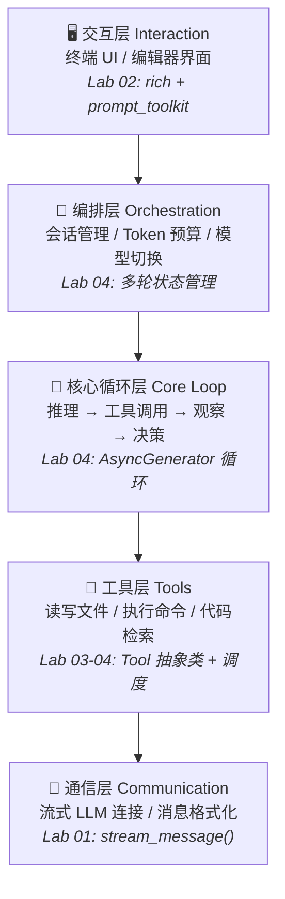
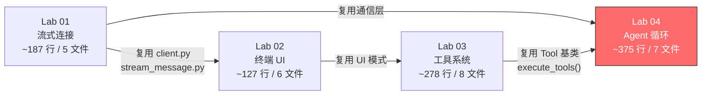
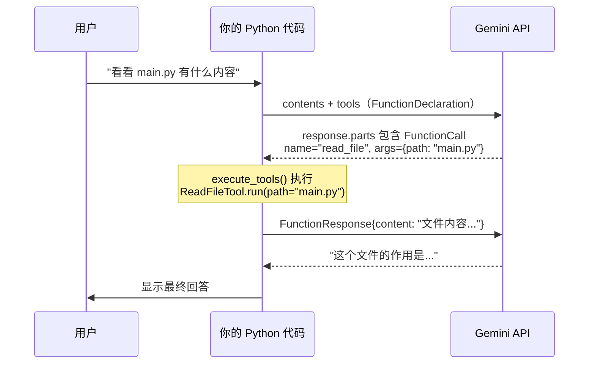
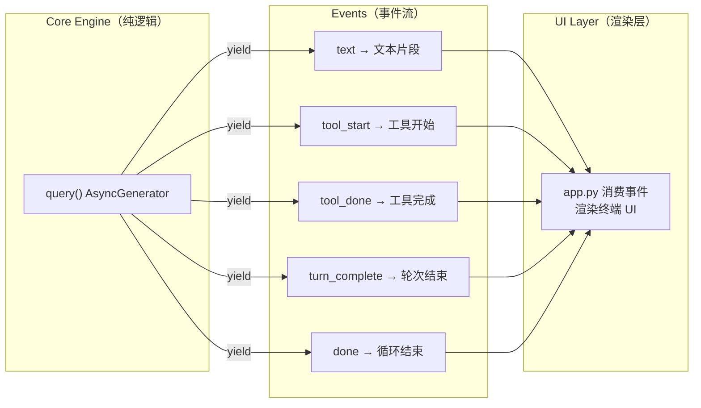

# 🗺️ Agent Engineering Roadmap — Python 学习路线图

> **目标读者**：只会 Python、想系统学习 AI Agent 工程化的开发者
> **项目地址**：[agent-engineering-roadmap-main](file:///a:/Root_Code/local-project/agent-engineering-roadmap-main)
> **预计总学时**：40-60 小时（按每天 2 小时计，约 3-4 周）

---

## 项目全景：你将学到什么

这个项目是一份 **Agent 工程化的完整学习路径**，拆解了 Claude Code、Cursor、Codex CLI 等主流 AI 编程工具的底层架构。它们在底层收敛于相同的 **5 层系统架构**：



### Python Labs 的技术栈

> [!IMPORTANT]
> Python Labs 使用的是 **Google Gemini API**（`google-genai` SDK），而非 TypeScript 版的 Anthropic SDK。核心概念完全相同，只是 API Provider 不同。

| 依赖 | 版本 | 用途 |
|------|------|------|
| `google-genai` | ≥0.1.1 | Gemini API 官方 SDK |
| `rich` | ≥13.0.0 | 终端富文本渲染 |
| `prompt_toolkit` | ≥3.0.0 | 异步交互式命令行输入 |

### 4 个 Lab 的渐进关系



> [!TIP]
> 代码是 **层层复用** 的：Lab 02 导入 Lab 01 的 `client.py` 和 `stream_message.py`；Lab 04 导入 Lab 01 的通信层 + Lab 03 的工具系统。这就是真实 Agent 的分层架构思想。

---

## 前置准备

### 你需要准备的

| 项目 | 要求 | 备注 |
|------|------|------|
| Python | 3.10+ | 用到了 `match` 语法、`X \| Y` 类型联合等 |
| 终端 | PowerShell / CMD | Windows 即可 |
| API Key | [Google AI Studio](https://aistudio.google.com/apikey) 免费获取 Gemini API Key | 免费额度足够做完所有 Lab |
| Git | 基本操作 | 建议具备 |

### 环境搭建

```bash
# 1. 进入项目根目录
cd a:\Root_Code\local-project\agent-engineering-roadmap-main

# 2. 创建虚拟环境
python -m venv .venv

# 3. 激活（Windows PowerShell）
.\.venv\Scripts\Activate.ps1

# 4. 安装依赖
pip install -r py_labs\requirements.txt

# 5. 设置 Gemini API Key
$env:GEMINI_API_KEY="your_gemini_api_key_here"
```

---

## 🗓️ 第一周：打地基（Stage 0 + Lab 01-02）

> **核心目标**：理解 LLM 交互的底层机制，搭建流式连接和终端 UI

---

### 📅 Day 1-2：Stage 0 — 基础概念（纯阅读）

理解从你的 Prompt 到模型输出之间究竟发生了什么。

| 序号 | 阅读文章 | 核心收获 | 预计时间 |
|------|----------|----------|----------|
| 1 | [Function Calling：LLM 如何使用工具](https://www.aibuilderclub.com/blog/function-calling-how-llms-use-tools) | 所有 Agent 的请求/响应底层机制 | 1h |
| 2 | [RAG vs 长上下文 vs 微调](https://www.aibuilderclub.com/blog/rag-vs-long-context-vs-fine-tuning) | 何时用检索、何时用长上下文、何时微调 | 1h |
| 3 | [Prompt → 上下文 → 基座的演进](https://www.aibuilderclub.com/blog/prompt-context-harness-evolution) | 提示词工程为何演变为系统工程 | 1h |

**✅ 通关标准**：
- [ ] 能解释 Function Calling 的流程：模型不执行函数，而是返回 JSON 说"我想调用 X 工具"
- [ ] 能区分 RAG 和长上下文窗口的适用场景
- [ ] 理解为什么 Prompt Engineering 正在演变为 Context Engineering

---

### 📅 Day 3-4：Lab 01 — 流式 LLM 连接

**目录**：[lab01_streaming_llm/](file:///a:/Root_Code/local-project/agent-engineering-roadmap-main/py_labs/lab01_streaming_llm)
**代码量**：~187 行 / 5 个文件

#### 文件结构与职责

```
lab01_streaming_llm/
├── __init__.py            # 包标识
├── client.py        (27行) # Gemini 客户端单例工厂
├── stream_message.py(84行) # ⭐ 核心：AsyncGenerator 流式包装器
├── main.py          (38行) # CLI 入口，消费流式事件
└── smoke.py         (36行) # 自动化冒烟测试
```

#### 关键代码解析

**[client.py](file:///a:/Root_Code/local-project/agent-engineering-roadmap-main/py_labs/lab01_streaming_llm/client.py)** — 客户端工厂：

```python
# 要理解的核心模式：单例工厂 + 环境变量验证
MODEL = "gemini-2.5-flash"
DEFAULT_MAX_TOKENS = 4_096

def get_client() -> genai.Client:
    api_key = os.environ.get("GEMINI_API_KEY")
    if not api_key:
        # 友好的错误提示，而非静默失败
        sys.exit(1)
    return genai.Client(api_key=api_key)
```

**[stream_message.py](file:///a:/Root_Code/local-project/agent-engineering-roadmap-main/py_labs/lab01_streaming_llm/stream_message.py)** — ⭐ 最重要的文件：

```python
# 定义事件类型：这是整个项目的事件驱动架构基础
@dataclass
class StreamEvent:
    kind: EventKind  # "message_start" | "text" | "tool_use_start" | "message_done"
    text: str = ""
    tool_name: str = ""
    tool_args: dict = field(default_factory=dict)

# 核心：AsyncGenerator 模式
async def stream_message(contents, *, tools=None, ...) -> AsyncGenerator[StreamEvent, None]:
    async for chunk in client.aio.models.generate_content_stream(...):
        if chunk.text:
            yield StreamEvent(kind="text", text=chunk.text)  # ← 每个文本块实时 yield
    yield StreamEvent(kind="message_done")  # ← 流结束信号
```

#### 动手步骤

```bash
# 1. 运行主程序
python -m py_labs.lab01_streaming_llm.main "什么是 AI Agent？"

# 2. 运行冒烟测试
python -m py_labs.lab01_streaming_llm.smoke
```

#### 改造练习

- [ ] 修改 `client.py`，把模型换成 `gemini-2.0-flash`，对比速度和质量差异
- [ ] 在 `main.py` 中实现 Token 用量的统计输出（从 `response.usage_metadata` 中提取）
- [ ] 写一个非流式版本（用 `client.aio.models.generate_content` 替代 `generate_content_stream`），对比用户体验
- [ ] 尝试传入超长 Prompt（>2000 字），观察流式输出的行为

> [!TIP]
> **为什么流式这么重要？** 它不仅仅是 UI 效果。在 Agent 系统中，流式是实现 **背压控制** 的基础——消费者（UI）可以按自己的速度处理数据，而不会被生产者（LLM）压垮。

---

### 📅 Day 5-6：Lab 02 — 终端 UI + 多轮对话

**目录**：[lab02_terminal_ui/](file:///a:/Root_Code/local-project/agent-engineering-roadmap-main/py_labs/lab02_terminal_ui)
**代码量**：~127 行 / 6 个文件

#### 文件结构与职责

```
lab02_terminal_ui/
├── __init__.py
├── client.py        (4行)  # 从 Lab 01 re-export
├── stream_message.py(4行)  # 从 Lab 01 re-export ← 注意代码复用！
├── app.py          (81行)  # ⭐ 交互式聊天应用
├── main.py         (15行)  # 入口
└── smoke.py        (21行)  # 非交互式测试
```

#### 关键代码解析

**[app.py](file:///a:/Root_Code/local-project/agent-engineering-roadmap-main/py_labs/lab02_terminal_ui/app.py)** — 交互式聊天：

```python
class App:
    def __init__(self):
        self.contents: List[types.Content] = []  # ← 多轮对话历史
        self.console = Console()                  # ← Rich 终端输出
        self.session = PromptSession()            # ← prompt_toolkit 异步输入

    async def run_turn(self, user_text: str):
        # 1. 添加用户消息到历史
        self.contents.append(types.Content(role="user", parts=[...]))
        # 2. 流式获取回复
        async for event in stream_message(self.contents):
            if event.kind == "text":
                sys.stdout.write(event.text)  # 实时输出
        # 3. 添加助手回复到历史
        self.contents.append(types.Content(role="model", parts=[...]))
```

#### 动手步骤

```bash
# 运行交互式聊天
python -m py_labs.lab02_terminal_ui.main
```

#### 改造练习

- [ ] 给 `App` 添加系统提示词，让 Agent 扮演"Python 教练"角色
- [ ] 实现对话历史的 **JSON 保存/加载**（退出时保存，启动时恢复）
- [ ] 添加 `/clear` 命令清空对话、`/history` 命令显示对话轮次
- [ ] 在每轮对话后显示累计 Token 用量

**🔑 多轮对话的核心模式**：

```
messages = [
    {role: "user",  parts: ["你好"]},
    {role: "model", parts: ["你好！有什么..."]},
    {role: "user",  parts: ["解释递归"]},     ← 每次都传完整历史
    {role: "model", parts: ["递归是..."]},
]
# Token 随对话轮次线性增长 → 后面会学上下文压缩
```

---

## 🗓️ 第二周：核心能力突破（Lab 03-04 + Stage 2）

> **核心目标**：理解工具系统和核心 Agent 循环，亲手跑通一个 Mini Coding Agent

---

### 📅 Day 7-8：Lab 03 — 工具系统（Function Calling）

**目录**：[lab03_first_tool/](file:///a:/Root_Code/local-project/agent-engineering-roadmap-main/py_labs/lab03_first_tool)
**代码量**：~278 行 / 8 个文件

#### 文件结构与职责

```
lab03_first_tool/
├── __init__.py
├── tools/
│   ├── base.py      (27行)  # ⭐ Tool 抽象基类 + ToolResult
│   ├── list_files.py(46行)  # list_files 工具实现
│   ├── read_file.py (41行)  # read_file 工具实现（带行号！）
│   └── index.py     (21行)  # 工具注册表
├── execute_tools.py (34行)  # ⭐ 工具执行调度器
├── main.py          (79行)  # 带工具的交互式聊天
└── smoke.py         (28行)  # 工具执行测试
```

#### 关键架构解析

**工具调用时序图**：



**[base.py](file:///a:/Root_Code/local-project/agent-engineering-roadmap-main/py_labs/lab03_first_tool/tools/base.py)** — 工具抽象基类：

```python
class Tool(ABC):
    name: str
    description: str
    input_schema: Dict[str, Any]   # JSON Schema 格式
    read_only: bool = True         # ← 权限标记！Lab 04 会用到

    @abstractmethod
    def run(self, **kwargs) -> ToolResult: ...

    def to_gemini_declaration(self) -> types.FunctionDeclaration:
        # 把 Python 工具定义转换为 Gemini API 要求的格式
        return types.FunctionDeclaration(
            name=self.name,
            description=self.description,
            parameters=self.input_schema,
        )
```

**[execute_tools.py](file:///a:/Root_Code/local-project/agent-engineering-roadmap-main/py_labs/lab03_first_tool/execute_tools.py)** — 工具调度器：

```python
def execute_tools(function_calls, tools_list=None) -> types.Content:
    available = {t.name: t for t in tools_list}  # 工具名 → 工具实例
    parts = []
    for fc in function_calls:
        tool = available.get(fc.name)
        result = tool.run(**dict(fc.args))        # 执行工具
        parts.append(types.Part(
            function_response=types.FunctionResponse(
                name=fc.name,
                response={"content": result.content},
            )
        ))
    return types.Content(role="user", parts=parts)  # 打包为 user 角色发回
```

#### 动手步骤

```bash
# 1. 直接测试工具
python -m py_labs.lab03_first_tool.smoke

# 2. 交互式使用
python -m py_labs.lab03_first_tool.main
# 试试说："读取 py_labs/requirements.txt 的内容"
# 试试说："列出 py_labs 目录下的所有文件"
```

#### 改造练习

- [ ] **添加新工具** `GetCurrentTime`：返回当前系统时间（继承 `Tool` 基类）
- [ ] **添加新工具** `SearchFiles`：在指定目录中搜索包含关键词的文件
- [ ] 给 `read_file` 添加错误处理：文件不存在、是目录、编码错误等情况
- [ ] 在 `index.py` 中把新工具注册到 `ALL_TOOLS`
- [ ] 思考：**为什么 `read_file` 要返回带行号的内容？** （提示：Lab 04 的 `edit_file` 需要精确定位）

> [!IMPORTANT]
> **关键洞察**：模型并不真正"调用"函数。它在回复中生成一个结构化的 `FunctionCall` 对象，说"我想调用 read_file，参数是 `{path: 'xxx'}`"。**是你的 `execute_tools()` 函数**负责解析、执行、然后把结果以 `FunctionResponse` 格式送回去。

---

### 📅 Day 9-12：Lab 04 — 核心 Agentic Loop（⭐ 全项目最重要）

**目录**：[lab04_agentic_loop/](file:///a:/Root_Code/local-project/agent-engineering-roadmap-main/py_labs/lab04_agentic_loop)
**代码量**：~375 行 / 7 个文件

#### 文件结构与职责

```
lab04_agentic_loop/
├── __init__.py
├── core/
│   └── agentic_loop.py (141行) # ⭐⭐⭐ 核心循环引擎 (AsyncGenerator!)
├── tools/
│   ├── edit_file.py     (74行) # 新增的写入工具（精确字符串替换）
│   └── index.py         (23行) # 扩展工具注册表
├── ui/
│   └── app.py           (77行) # 终端 UI + 人机协作权限确认
├── main.py              (15行) # 入口
└── smoke.py             (43行) # 自动化集成测试
```

#### ⭐ 核心循环架构

**[agentic_loop.py](file:///a:/Root_Code/local-project/agent-engineering-roadmap-main/py_labs/lab04_agentic_loop/core/agentic_loop.py)** — 这是整个项目的灵魂：

```python
async def query(
    contents: List[types.Content],
    *,
    max_turns: int = 10,
    can_use_tool: CanUseToolFn | None = None,  # ← 权限回调！
) -> AsyncGenerator[LoopEvent, None]:          # ← AsyncGenerator！
    """
    核心循环：
    for turn in range(max_turns):
        1. 调用 Gemini API → 获取响应
        2. 检查是否有 FunctionCall
           - 没有 → yield done 事件，return
           - 有   → 权限检查 → 执行工具 → 添加结果到历史 → 继续循环
    """
    for turn in range(max_turns):
        # 流式获取模型响应
        async for ev in stream_message(contents, tools=gemini_tools):
            if ev.kind == "text":
                yield LoopEvent(kind="text", text=ev.text)  # 实时传递文本

        # 检查是否有工具调用
        function_calls = [part.function_call for part in response.parts if part.function_call]

        if not function_calls:
            yield LoopEvent(kind="done")  # 没有工具调用 = 任务完成
            return

        # 权限检查（非只读工具需确认）
        for fc in function_calls:
            tool = find_tool(fc.name)
            if tool and not tool.read_only and can_use_tool:
                allowed = await can_use_tool(fc.name, dict(fc.args))  # ← 暂停等用户确认
                if not allowed:
                    return

        # 执行工具 & 继续循环
        tool_response = execute_tools(function_calls, tools_list)
        contents.append(tool_response)

    yield LoopEvent(kind="done", text="max_turns|...")  # 安全限制触发
```

**事件驱动架构图**：



#### 三大设计亮点

| 设计 | 代码位置 | 为什么重要 |
|------|----------|-----------|
| **AsyncGenerator 模式** | `query()` 函数 | 解耦循环逻辑和 UI 渲染。生产级 Agent 都用这个模式 |
| **Human-in-the-Loop 权限** | `can_use_tool` 回调 | `edit_file` 等写操作需要人类确认。权限策略在引擎外部，引擎只负责"问" |
| **精确字符串替换** | `edit_file.py` | 检查 `old_string` 恰好出现一次。0 次 = 上下文过时，>1 次 = 定位模糊 |

#### 动手步骤

```bash
# 1. 运行冒烟测试（不需要交互）
python -m py_labs.lab04_agentic_loop.smoke

# 2. 运行交互式 Agent
python -m py_labs.lab04_agentic_loop.main

# 试试这些任务：
# "列出 py_labs 目录下的所有文件并解释结构"
# "读取 lab01 的 client.py，解释每行代码的作用"
# "在当前目录创建一个 hello.py，写一个打印 Hello World 的程序"（会触发权限确认！）
```

#### 改造练习（⭐ 重点完成）

- [ ] **添加 `execute_command` 工具**：用 `subprocess.run` 执行 shell 命令（注意安全！设 `read_only=False`）
- [ ] **添加 `search_files` 工具**：用 grep/findstr 在目录中搜索文本模式
- [ ] 给每次工具调用添加 **耗时统计**（`time.perf_counter()`）
- [ ] 实现 **对话历史持久化**：用 JSONL 格式保存每轮对话（这是行业标准）
- [ ] 添加 **Token 预算限制**：超过 N 个 Token 时自动停止并提示用户
- [ ] 给 `execute_command` 添加 **命令黑名单**（禁止 `rm -rf`、`format` 等危险命令）

> [!WARNING]
> **Lab 04 是整个路线图的分水岭。** 如果你只有时间做一个 Lab，就做 Lab 04。理解了这 375 行代码，你就理解了 Claude Code 等工具 80% 的核心原理。

---

### 📅 Day 13-14：Stage 2 — 精通生产级 Agent（阅读）

| 序号 | 阅读文章 | 预计时间 |
|------|----------|----------|
| 1 | [Karpathy 的 CLAUDE.md 规则指南](https://www.aibuilderclub.com/blog/karpathy-claude-md-rules) | 45min |
| 2 | [Claude Code Hooks 完整指南](https://www.aibuilderclub.com/blog/claude-code-hooks-complete-guide) | 45min |
| 3 | [Sub-agents 指南](https://www.aibuilderclub.com/blog/claude-code-sub-agents-guide) | 45min |
| 4 | [基于 Git Worktrees 的并行 Agent](https://www.aibuilderclub.com/blog/claude-code-worktree-parallel-agents) | 30min |
| 5 | [Agent Teams 团队协作](https://www.aibuilderclub.com/blog/claude-code-agent-teams-guide) | 30min |

**✅ 通关标准**：
- [ ] 能解释 Hooks 如何为概率性系统提供确定性保证（类比你在 Lab 04 中实现的 `can_use_tool` 回调）
- [ ] 理解 Sub-agent 的核心价值：**上下文隔离**
- [ ] 能画出多 Agent 协作的架构图

---

## 🗓️ 第三周：进阶理论（Stage 3-5）

> **核心目标**：掌握上下文工程、MCP 协议和基座工程

---

### 📅 Day 15-16：Stage 3 — 上下文工程

| 阅读文章 | 核心收获 | 预计时间 |
|----------|----------|----------|
| [上下文工程指南](https://www.aibuilderclub.com/blog/context-engineering-guide) | System Prompt 架构、上下文预算、性能衰减 | 1.5h |
| [Agent 记忆系统](https://www.aibuilderclub.com/blog/agent-memory-systems-guide) | 会话级、项目级、长期记忆模式 | 1.5h |
| [TodoWrite vs Task](https://www.aibuilderclub.com/blog/claude-code-todowrite-vs-task) | 执行计划的外部化存储 | 1h |

**✅ 通关标准**：
- [ ] 能解释"决定遗忘什么比决定记住什么更难"
- [ ] 能设计三层记忆系统的数据结构
- [ ] 理解 Token 预算管理的必要性

**🛠️ 实践**：回到 Lab 04，实现：
- [ ] 对话超过 5 轮时，自动用 LLM 压缩早期消息为摘要
- [ ] 实现项目记忆文件（类似 CLAUDE.md），Agent 启动时自动加载为 `system_instruction`

---

### 📅 Day 17-18：Stage 4 — MCP 与 Skills

| 阅读文章 | 核心收获 | 预计时间 |
|----------|----------|----------|
| [构建你的第一个 MCP 服务器](https://www.aibuilderclub.com/blog/mcp-101-build-mcp-servers) | MCP 协议动手实践 | 1.5h |
| [MCP 架构解密](https://www.aibuilderclub.com/blog/mcp-internals-client-server) | 传输层协议设计 | 1h |
| [MCP 安全攻击向量](https://www.aibuilderclub.com/blog/mcp-security-attack-vectors) | 安全威胁模型 | 1h |
| [Agent Skills 最佳实践](https://www.aibuilderclub.com/blog/agent-skills-best-practices-guide) | 封装可复用工作流 | 1h |

**✅ 通关标准**：
- [ ] 能解释 MCP 客户端-服务器架构
- [ ] 了解至少 3 种 MCP 安全攻击向量
- [ ] 理解 Skills（可复用工作流）与 Tools（原子操作）的区别

---

### 📅 Day 19-20：Stage 5 — 基座工程

| 阅读文章 | 核心收获 | 预计时间 |
|----------|----------|----------|
| [Agent Harness 六大核心组件](https://www.aibuilderclub.com/blog/harness-six-components) | 环境、验证、权限、记忆、工具、触发器 | 1.5h |
| [生产环境的 Harness 工程](https://www.aibuilderclub.com/blog/harness-engineering-agent-production-guide) | 如何让代码库 Agent Ready | 1.5h |
| [操作系统级 Agent 沙箱](https://www.aibuilderclub.com/blog/agent-sandbox-os-level-security) | 纵深防御机制 | 1h |

**✅ 通关标准**：
- [ ] 能列举 Harness 的 6 大组件
- [ ] 理解为什么 `execute_command` 需要沙箱隔离（联想 Lab 04 的 `read_only` 标记）
- [ ] 能设计 Allow / Ask / Deny 权限系统（联想 Lab 04 的 `can_use_tool` 回调）

---

## 🗓️ 第四周：高级主题 + 综合实战（Stage 6-7）

> **核心目标**：理解循环工程和生产评估，完成综合实战项目

---

### 📅 Day 21-22：Stage 6 — 循环工程

| 阅读文章 | 核心收获 | 预计时间 |
|----------|----------|----------|
| [循环工程指南 (2026版)](https://www.aibuilderclub.com/blog/loop-engineering-guide-2026) | Verifier 是核心瓶颈 | 1.5h |
| [循环工程 vs 基座工程](https://www.aibuilderclub.com/blog/loop-engineering-vs-harness-engineering) | 两大学科对比 | 1h |
| [Claude Code 动态工作流](https://www.aibuilderclub.com/blog/claude-code-dynamic-workflows) | 多 Agent 确定性编排 | 1h |
| [Agent 模式选型](https://www.aibuilderclub.com/blog/agent-modes-plan-default-auto) | Plan / Default / Auto | 45min |

**✅ 通关标准**：
- [ ] 能解释 Loop Engineering 与 Harness Engineering 的互补关系
- [ ] 理解 Verifier 为什么是循环工程的瓶颈
- [ ] 描述 Plan / Default / Auto 三种模式的适用场景

---

### 📅 Day 23：Stage 7 — 生产评估与成本控制

| 阅读文章 | 核心收获 | 预计时间 |
|----------|----------|----------|
| [如何评估 AI Agent](https://www.aibuilderclub.com/blog/how-to-evaluate-ai-agents) | 轨迹、结果与验证器 | 1.5h |
| [Agent 可靠性与成本控制](https://www.aibuilderclub.com/blog/ai-agent-reliability-cost-control) | 故障模式与预算调节 | 1h |

---

### 📅 Day 24-28：🏆 综合实战项目

在 Lab 04 基础上，构建一个 **升级版 Coding Agent**：

```
my_agent/
├── main.py                   # 入口 + Rich 终端 UI
├── core/
│   └── agentic_loop.py       # AsyncGenerator 循环（基于 Lab 04）
├── services/
│   └── stream_message.py     # 通信层（基于 Lab 01）
├── tools/
│   ├── base.py               # Tool 基类（基于 Lab 03）
│   ├── read_file.py
│   ├── edit_file.py
│   ├── execute_command.py    # 新增：带沙箱
│   ├── search_files.py       # 新增
│   └── index.py              # 工具注册表
├── context/
│   ├── memory.py             # 项目记忆（类似 CLAUDE.md）
│   └── compressor.py         # 上下文压缩（超 N 轮后压缩）
├── security/
│   └── permissions.py        # Allow / Ask / Deny 权限系统
├── history/
│   └── store.py              # JSONL 对话历史持久化
└── config.py                 # 配置管理
```

**必须实现的特性**：
- [ ] AsyncGenerator 循环模式（循环逻辑与 UI 分离）
- [ ] 至少 5 个工具（read_file, edit_file, list_files, execute_command, search_files）
- [ ] 人机协作权限确认（非只读工具需确认）
- [ ] 对话历史 JSONL 持久化
- [ ] Token 预算限制 + 基本的上下文压缩
- [ ] MAX_TURNS 安全限制
- [ ] 命令黑名单安全机制
- [ ] 友好的错误处理和 Rich 终端输出

---

## 📚 Python 必备知识点（按需补课）

| 知识点 | 为什么需要 | 在哪里用到 | 补课资源 |
|--------|-----------|-----------|---------|
| `asyncio` + `async/await` | 所有 Lab 都是异步的 | 全部 Lab | Python 官方文档 asyncio 章节 |
| `AsyncGenerator`（`async def` + `yield`） | Lab 04 的核心模式 | Lab 01, 04 | PEP 525 |
| `dataclass` | 事件类型定义 | Lab 01-04 | Python dataclasses 文档 |
| `ABC`（抽象基类） | 工具基类设计 | Lab 03-04 | Python abc 模块文档 |
| `typing`（类型标注） | `Literal`, `Callable`, `Awaitable` | 全部 Lab | Python typing 文档 |
| `rich` 库 | 终端 UI 渲染 | Lab 02-04 | rich 官方文档 |
| `prompt_toolkit` | 异步交互式输入 | Lab 02-04 | prompt_toolkit 文档 |
| `subprocess` | 执行系统命令 | 改造练习 | Python subprocess 文档 |

---

## Open Questions

> [!IMPORTANT]
> 以下问题会影响路线图的调整，请反馈：

1. **你的 `asyncio` 水平**：是否熟悉 `async/await` 和 `AsyncGenerator`？这直接影响 Lab 的理解难度。如果不熟悉，我需要在 Day 3 前插入一个 asyncio 速成模块。

2. **你的目标**：是想理解原理为主，还是最终要自己构建生产级 Agent？后者需要在 Stage 5-7 增加更多实践时间。

3. **是否需要我为每个 Lab 生成逐行中文注释版本**？代码量不大（总共 ~967 行），我可以快速生成带注释的副本。
