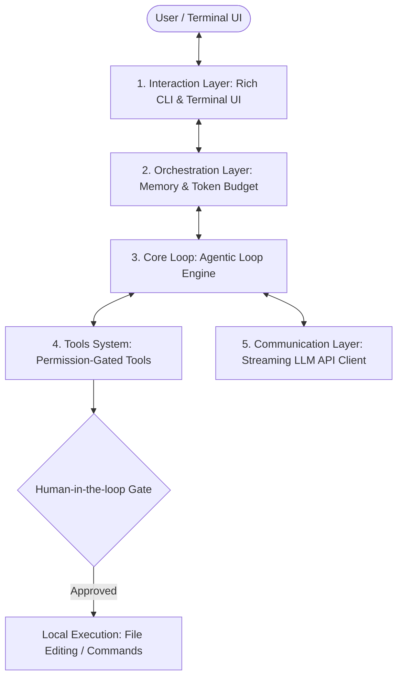

# CS Study Notes & AI Agent Engineering Hub 🚀

[](https://opensource.org/licenses/MIT)
[](https://www.python.org/)
[]()
[]()

Welcome to the **CS Study Notes & AI Agent Engineering Hub**! This repository serves as a comprehensive knowledge base and engineering laboratory bridging fundamental computer science concepts with modern **AI-Native Software Engineering** and **Zero-Framework Agent Architecture**.

---

## 🌟 Featured Project: AI Agent Engineering Laboratory

> **Location**: [`/6_Py/my_agent`](./6_Py/my_agent) and [`/6_Py/agent-engineering-roadmap-main`](./6_Py/agent-engineering-roadmap-main)

A core highlight of this repository is a production-grade, framework-free **AI Agent Engine** built from the ground up in Python. Instead of relying on black-box agent frameworks, it implements a decoupled 5-layer architecture to demonstrate the pure mechanics of streaming LLM connections, function calling, tool execution, and autonomous decision loops.

### 🏛️ The 5-Layer Agent Architecture



| Layer | Component | Description & Key Features |
|---|---|---|
| **1. Interaction** | Terminal UI | Real-time markdown streaming via `rich.Live`, asynchronous prompt session with `prompt_toolkit`. |
| **2. Orchestration** | Session State & Memory | Multi-turn conversation state tracking (`self.contents`) and token usage accounting. |
| **3. Core Loop** | `agentic_loop.py` | Autonomous decision state machine: `LLM Inference` ➔ `Tool Call` ➔ `Execute` ➔ `Re-evaluate` (capped at max safety turns). |
| **4. Tools System** | Dynamic Tool Registry | Abstract `Tool` base class with `read_only` security flags. Supports interactive `y/N` user approval for write actions (`EditFile`). |
| **5. Communication** | Async Stream Engine | Low-latency streaming connection using `google-genai` yielding structured `StreamEvent` and `LoopEvent` primitives. |

---

## 📁 Repository Structure

```
Github_Workspace/
├── 6_Py/                          # 🤖 AI Agent Engineering & Python Labs (Core Focus)
│   ├── my_agent/                  # Custom Zero-Framework AI Agent Engine
│   │   ├── client/                # Async LLM streaming client & event generator
│   │   ├── core/                  # Autonomous agentic loop state machine
│   │   ├── tools/                 # Tool implementations (ReadFile, EditFile, ListFiles)
│   │   └── ui/                    # Rich terminal UI with human-in-the-loop security
│   ├── agent-engineering-roadmap-main/ # 8-Stage Agent Learning Path & Labs (01-04)
│   ├── MyAgent-v4/                # Modular agent iteration v4
│   └── MyMinimumSWEAgent/         # Lightweight SWE Agent implementation
│
├── 1_Java_Ecosystem/              # ☕ Java SE, Spring Projects & Enterprise Architecture
├── 2_Algorithms/                  # 🧩 Data Structures, LeetCode & Algorithm Implementations
├── 3_FrontEnd_Web/                # 🌐 Modern Frontend Architecture & Web Technologies
├── 4_C_CPP/                       # ⚡ C/C++ Systems Programming & Memory Management
├── 5_Database_SQL/                # 🗄️ Database Design, Relational SQL & ORM Practices
└── article/                       # 📝 Technical Articles, Multi-threading & Design Notes
```

---

## 🚀 Quick Start: Running the AI Agent

### Prerequisites
- Python 3.10+
- Gemini API Key (or OpenAI API compatible configuration)

### Installation & Execution

1. **Clone the repository**:
   ```bash
   git clone https://github.com/kuonyuma/CS-Study-Notes.git
   cd CS-Study-Notes
   ```

2. **Install dependencies**:
   ```bash
   pip install -r 6_Py/agent-engineering-roadmap-main/py_labs/requirements.txt
   ```

3. **Set your API Key**:
   ```bash
   # Linux/macOS
   export GEMINI_API_KEY="your_api_key_here"

   # Windows PowerShell
   $env:GEMINI_API_KEY="your_api_key_here"
   ```

4. **Launch the Agent**:
   ```bash
   python 6_Py/my_agent/main.py
   ```

---

## 💡 Key Design Philosophies

- **Zero-Framework Transparency**: Built purely with raw API calls and native Python to ensure full control, testability, and deep architectural understanding.
- **Human-in-the-Loop Security**: Any non-read-only action (such as code editing or file modifications) requires explicit user confirmation (`y/N`), safeguarding local project state.
- **Pull-Based Event Streaming**: Clean decoupling of UI rendering from LLM inference using `AsyncGenerator[LoopEvent, None]`.

---

## 📄 License

This repository is licensed under the [MIT License](LICENSE).
